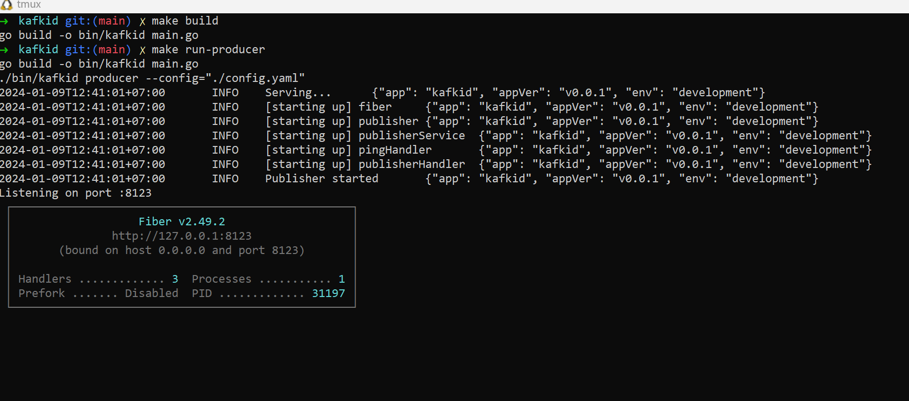
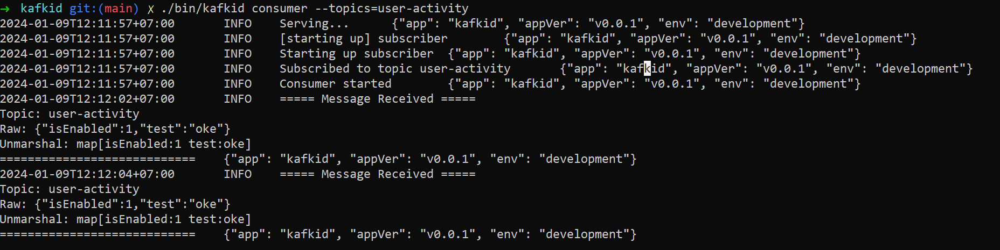

# :bullettrain_front: Kafkid - Kafka Messaging Service

This project provides a simple messaging service that allows publishing and consuming messages through Kafka. It includes an API for message publishing and a consumer for message consumption.

## Feature

- Publish messages to Kafka through a simple API.
- Consume messages from Kafka using a consumer.
- Configurable settings for Kafka connection and topics.

## Prerequisites

Make sure you have the following installed before setting up and running the messaging service:

- Kafka
- Zookeeper

This project provides `zk-single-kafka-single.yaml` you can run this command to easy setup Kafka and Zookeeper using docker

```bash
docker-compose -f zk-single-kafka-single.yaml up -d
```

## Getting Started

### Configuration

Copy `config.sample.yaml` to `config.yaml` and modify based on your needs.

### Download Package

```bash
make install
```

### Usage

### Run Producer Service

```bash
make build
./bin/kafkid producer
```



#### Publishing Message

To publish a message to Kafka, use the provided API. Replace the placeholder values with your actual data.

```json
POST http://localhost:8123/v1/publish
{
    "topic": "notification",
    "message": {
        "test": "oke",
        "isEnabled": 1
    }
    // "message": "you can send any type of message"
}
```

### Run Consumer Service

```bash
make build
./bin/kafkid consumer --topics=topic1,topic2
```

After you ran this command, the consumed message will be printed in console log


## Contributing

Contributions are welcome! Please follow the [Contribution Guidelines](CONTRIBUTION.md).

## License

This project is licensed under the MIT License.